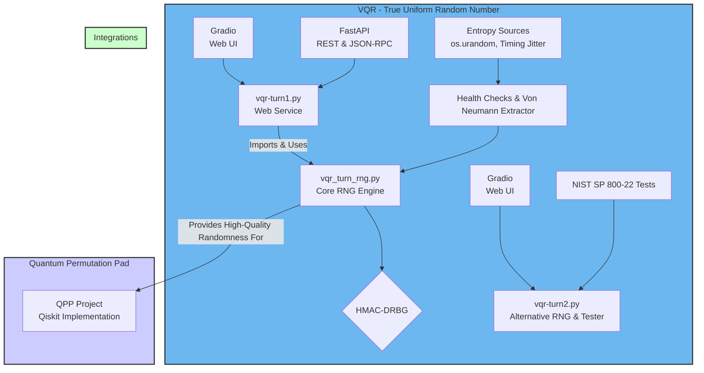

# Virtual Quantum Reality (VQR) & Quantum Privacy Preserving (QPP)

This repository hosts two distinct but related projects: **Virtual Quantum Reality (VQR) – True Uniform Random Number (TURN)**, which explores methods for generating high-quality random numbers in software, and **Quantum Privacy Preserving (QPP)**, which provides implementations of a quantum cryptographic primitive using Qiskit.

---

## Table of Contents
- [VQR – True Uniform Randomness (TURN)](#vqr--true-uniform-randomness-turn)
  - [Overview](#overview)
  - [Architecture Diagram](#architecture-diagram)
  - [Core RNG Engine: `vqr_turn_rng` Analysis](#core-rng-engine-vqr_turn_rngpy-analysis)
  - [Implementations](#implementations)
  - [Installation](#installation)
  - [Usage](#usage)
- [Quantum Privacy Preserving (QPP)](#quantum-privacy-preserving-qpp)
  - [Overview](#qpp-overview)
  - [QPP Directory Structure](#qpp-directory-structure)
  - [QPP Setup and Execution](#qpp-setup-and-execution)
  - [References](#references)
- [Additional Files](#additional-files)

---

## VQR – True Uniform Randomness (TURN)

### Overview

This project explores the conceptual and practical aspects of generating truly unpredictable and uniform random numbers in software, aiming to mimic quantum randomness without requiring quantum hardware. It leverages techniques like entropy amplification, bias correction, and cryptographic hardening to produce high-quality randomness.

### Architecture Diagram

The following diagram illustrates the architecture of the VQR/TURN project, its components, and its potential integration with the QPP project.



### Core RNG Engine: `vqr_turn_rng.py` Analysis

The `vqr_turn_rng.py` script implements a conceptual **Virtual Quantum Reality / True Uniform Random Number (VQR/TURN)** generator. It is designed as a teaching and demonstration tool, not as a cryptographically secure generator for production use.

The architecture follows a sophisticated multi-stage pipeline to produce high-quality random numbers:

1.  **Entropy Collection:**
    *   It gathers initial randomness (entropy) from two distinct sources:
        *   `os.urandom`: A cryptographically strong source of randomness provided by the operating system.
        *   **Timing Jitter:** A custom function (`_timing_jitter_bytes`) that measures the tiny, unpredictable variations in CPU execution time from a tight loop. This mimics a physical entropy source.

2.  **Health Checks & Conditioning:**
    *   Before use, the raw entropy undergoes online **health checks** to detect potential failures or biases. These include:
        *   A **Repetition Count Test** to ensure no long runs of identical bits.
        *   An **Adaptive Proportion Test** to verify that the number of 0s and 1s is balanced.
    *   The raw data is then passed through a **Von Neumann extractor** (`_von_neumann`), a classic algorithm that removes statistical bias from a bitstream.
    *   Finally, the debiased entropy is mixed and condensed into a fixed-size seed using the **SHA3-256** hash function.

3.  **Random Number Generation:**
    *   The processed seed is used to initialize a **HMAC-DRBG** (Deterministic Random Bit Generator), which is implemented following the style of NIST SP 800-90A, a widely recognized standard.
    *   This DRBG is the core engine that expands the initial seed into a long stream of pseudo-random bytes.

4.  **Reseeding:**
    *   To ensure long-term security and prevent the internal state from becoming stale, the generator automatically **reseeds** itself with fresh entropy after generating a certain amount of data (1 MB by default).

5.  **Statistical Validation:**
    *   The file also includes utility functions for basic statistical analysis of the output, such as a **Monobit Frequency Test** and a **Chi-Square Uniformity Test**, to provide a sanity check on the quality of the generated random numbers.

### Implementations

There are three Python scripts in this project:

*   `vqr_turn_rng.py`: This file contains the core implementation of the VQR/TURN random number generator. For a detailed breakdown, see the [Core RNG Engine Analysis](#core-rng-engine-vqr_turn_rngpy-analysis) section above.

*   `vqr-turn1.py`: This script exposes the `VQRTurnRNG` from `vqr_turn_rng.py` as a web service. It uses FastAPI to create REST and JSON-RPC 2.0 endpoints for generating random floats, 64-bit unsigned integers, and bytes. It also provides a simple web interface using Gradio for easy demonstration.

*   `vqr-turn2.py`: This file presents an alternative implementation that focuses on generating random bits and testing their quality using the NIST SP 800-22 statistical test suite. It also provides a Gradio UI and a FastAPI REST API. This implementation uses Python's standard `random` module for bit generation, which is not cryptographically secure, and is intended for demonstration and testing purposes.

### Installation

To run these scripts, you need to install the required Python packages. You can install them using pip:

```bash
pip install fastapi uvicorn gradio sp80022suite
```

### Usage

You can run each of the `vqr-turn` scripts as follows:

*   **`vqr-turn1.py`**: This will start a web server with the Gradio UI and the API.
    ```bash
    python vqr-turn1.py
    ```
    - The FastAPI service will be available at `http://localhost:8000`.
    - The Gradio UI will be available at `http://localhost:7860`.

*   **`vqr-turn2.py`**: This script can be run in two modes.
    - To launch the Gradio UI:
      ```bash
      python vqr-turn2.py
      ```
    - To launch the FastAPI API:
      ```bash
      python vqr-turn2.py api
      ```

---

## Quantum Privacy Preserving (QPP)

### QPP Overview

This project contains companion Jupyter notebooks for Quantum Permutation Pad (QPP) implementations with Qiskit Runtime and Qiskit AerSimulator, ranging from 2 to 9 qubits. It serves as illustrations for the paper: Chancé, A. (2024). Quantum Permutation Pad with Qiskit Runtime. In: Femmam, S., Lorenz, P. (eds). ICCNT 2022. Springer, Cham. https://doi.org/10.1007/978-3-031-59619-3_12

### QPP Directory Structure

The `QPP/` folder contains the implementation of the Quantum Permutation Pad (QPP) with Qiskit Runtime.

*   `QPP/Alice`: Contains the code for Alice, the sender, including Jupyter notebooks for agent setup and QPP execution.
*   `QPP/Bob`: Contains the code for Bob, the receiver, including Jupyter notebooks for agent setup and QPP execution.
*   `QPP/QPP_2_qubits`: Contains the implementation and related files for the 2-qubit QPP.
*   `QPP/QPP_4_qubits`: Contains the implementation and related files for the 4-qubit QPP.
*   `QPP/QPP_9_qubits`: Contains the implementation and related files for the 9-qubit QPP.
*   `QPP/README.md`: Specific documentation for the QPP project.

### QPP Setup and Execution

1.  **Set up IBM Cloud account (optional)**: Refer to [this guide](https://quantum.cloud.ibm.com/docs/en/guides/cloud-setup) for details on how to set up your IBM Cloud account on the upgraded IBM Quantum Platform.
2.  **Run `Bob_agent.ipynb`**: This notebook starts a receiver agent (uvicorn server) to receive files.
3.  **Run `QPP_Alice.ipynb`**: This notebook guides Alice through the QPP setup.
4.  **Run `QPP_Bob.ipynb`**: This notebook guides Bob through the decryption process.

For more detailed instructions, please refer to the `QPP/README.md` file.

### References

[1] Kuang, Randy. Quantum Permutation Pad for Quantum Secure Symmetric and Asymmetric Cryptography. Vol. 2, no. 1, Academia Quantum, 2025. https://doi.org/10.20935/AcadQuant7457

[2] I. Burge, M. T. Mai and M. Barbeau, "A Permutation Dispatch Circuit Design for Quantum Permutation Pad Symmetric Encryption," 2024 13th International Conference on Communications, Circuits and Systems (ICCCAS), Xiamen, China, 2024, pp. 35-40, doi: 10.1109/ICCCAS62034.2024.10652827.

[3] Chancé, A. (2024). Quantum Permutation Pad with Qiskit Runtime. In: Femmam, S., Lorenz, P. (eds) Recent Advances in Communication Networks and Embedded Systems. ICCNT 2022. Lecture Notes on Data Engineering and Communications Technologies, vol 205. Springer, Cham. https://doi.org/10.1007/978-3-031-59619-3_12

---

## Additional Files

*   `NIST-80022-Statistical Test Suite.pdf`: This document contains the NIST 800-22 Statistical Test Suite, which is relevant for evaluating the randomness of the VQR/TURN generator.
*   `Quantum Permutation Pad.pdf`: This PDF provides foundational information about the Quantum Permutation Pad (QPP) concept.
